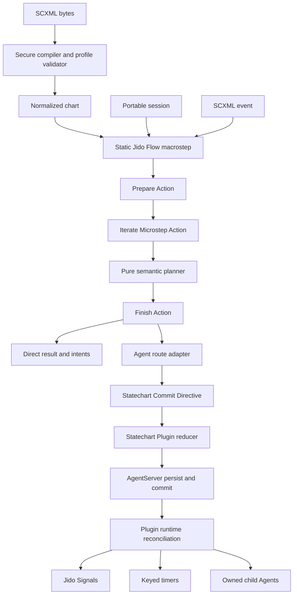
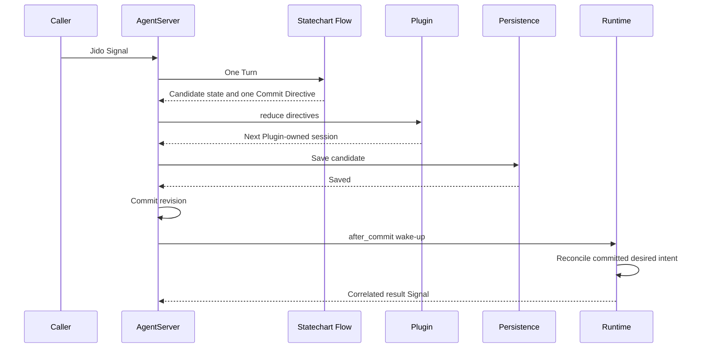
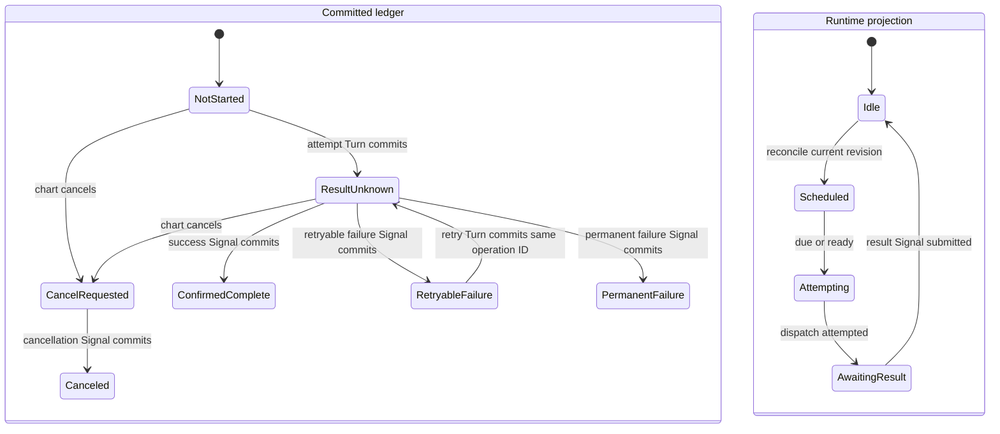

# Jido SCXML Runtime - Plan

## Goal Capsule

- **Objective:** Build a new `jido_statechart` package that compiles the Jido SCXML 1.0 Profile and executes each macrostep through Jido.Flow and Runic.
- **Authority:** The Product Contract defines package behavior. The Planning Contract defines implementation choices. The W3C SCXML 1.0 Recommendation and errata govern SCXML behavior except for the listed profile deviations.
- **Execution profile:** Build the package from its public contracts inward. Add tests before each semantic or runtime capability.
- **Stop conditions:** Stop if the work needs an unplanned public-contract change in `jido_action`, `jido`, or `jido_signal`. Stop if a supported W3C assertion conflicts with a stated profile rule.
- **Tail ownership:** The final unit owns the conformance matrix, package guides, examples, CI matrix, and release checks.

---

## Product Contract

### Summary

The package will provide a secure SCXML authoring format, a deterministic statechart semantic kernel, one canonical Jido.Flow macrostep, and a live Jido Agent integration. It will publish a Jido SCXML 1.0 Profile with exact support, omission, and deviation records. It will not claim full W3C processor conformance.

### Problem Frame

Jido.Flow supplies bounded in-memory execution, but its graph is acyclic. SCXML charts are cyclic and require legal active configurations, run-to-completion macrosteps, an internal event queue, history, parallel regions, delayed sends, and invocation lifecycle rules. A chart cannot map each state and transition to Flow graph edges.

Jido V3 already owns the missing session services. AgentServer serializes Turns and owns commit order. Signals carry external events. Plugins own portable state and supervised runtime resources. Directives carry post-commit effects. Child Agents provide a local invocation target. The package must combine these contracts without adding another executor, server, or durable orchestration system.

The W3C contract and the Jido contract differ at some points. Jido bounds work, restricts XML for safety, commits before external dispatch, and starts or stops children after commit. These differences must be public profile rules, not hidden implementation details.

### Actors

- A1. A chart author supplies SCXML that uses the declared profile and application-owned behavior identifiers.
- A2. An application developer compiles charts, registers trusted behavior, and chooses direct Flow execution or live Agent execution.
- A3. An operator restores sessions, inspects stable state, and diagnoses runtime intent or profile failures.
- A4. A product integrator builds authoring, MCP, or visual tools above the package's machine-readable compiler and inspection APIs.

### Key Product Decision

- **Profile identity:** Publish a `Jido SCXML 1.0 Profile` and an evidence matrix. Do not publish a full W3C conformance claim. (session-settled: user-approved — chosen over a full-conformance claim: finite work, secure XML parsing, and Jido effect timing are intentional differences.) Governs R1, R2, R20, R24.

### Requirements

#### Profile and compiler

- R1. The package shall define each SCXML feature as `supported`, `unsupported`, `deviation`, or `not_applicable`, with a W3C section and assertion reference where one exists.
- R2. The compiler shall accept bounded UTF-8 XML with SCXML namespace handling and shall reject DTDs, entity declarations, external resource access, unsupported processing instructions, and unsupported encodings.
- R3. The compiler shall return an immutable normalized chart with document-order indexes, generated IDs, lookup indexes, source paths, a profile version, and a deterministic chart fingerprint.
- R4. Compiler failures shall contain a stable code, severity, source path or location, profile feature, and bounded redacted correction data that tools can process.
- R5. The package shall expose a capability manifest and a safe inspection API for chart identity, active configuration, history, completion state, redacted trace data, and pending intent IDs.

#### SCXML semantics

- R6. A configuration shall support atomic, compound, parallel, final, shallow-history, and deep-history states as a legal ordered set of active atomic states.
- R7. Transition selection shall compute the optimal enabled transition set with descendant priority, conflict preemption, transition domain rules, and document-order tie handling.
- R8. A microstep shall run exits, transition executable content, and entries in SCXML order.
- R9. A macrostep shall process eventless transitions and the FIFO internal queue until the chart is stable or a work limit stops the Turn.
- R10. The kernel shall support multi-target transitions, targetless transitions, initial and history transition content, completion events, parallel completion, and deterministic generated IDs.
- R11. An unhandled external event shall produce a successful stable no-op result. An unhandled internal error event shall be discarded by the normal event rules.
- R12. The null data model shall implement its W3C restrictions and `In(state_id)` without application data or script support.
- R13. The Jido data model shall use portable values, trusted expression identifiers, bounded `Jido.Expr` values, string-keyed data locations, and `In(state_id)` without evaluating Elixir or JavaScript source.
- R14. The profile shall support the applicable executable content for the null and Jido data models, including `raise`, `if` branches, `foreach`, `assign`, `log`, `send`, and `cancel`; `<script>` remains unsupported.
- R15. Authored expression, assignment, and executable-content failures shall enter the internal queue as `error.execution` when the session remains valid. Invalid configurations, fingerprint conflicts, and limit exhaustion shall be fatal.
- R36. The profile shall define `datamodel`, `data`, `donedata`, `param`, `content`, entry, exit, transition, initial, history, and finalize content together with protected SCXML system variables such as `_event` and `_sessionid`.

#### Flow execution

- R16. Direct execution shall run initialization or one external event as one bounded, atomic Jido.Flow macrostep and shall return the next stable session, ordered intents, trace, and operation counts without dispatching external work.
- R17. A registered Jido Action extension shall execute through `Jido.Exec` with a minimal package-owned context and shall reject effects, streams, opaque output, and continuations inside a semantic microstep.
- R18. Direct Flow execution and live Agent execution shall produce the same stable session and ordered intent set when they receive the same deterministic Action outcomes and other inputs.
- R19. The package trace shall expose SCXML microsteps because one Jido.Flow Iterate component is one visible Runic work unit.

#### Live Jido session

- R20. One Statechart Plugin instance shall own one portable session per Agent and shall keep process IDs, timer references, task references, and child handles outside committed state.
- R21. A package helper shall initialize a live session in a reserved Turn before normal use, and a completed session shall remain inspectable until any required cleanup is confirmed.
- R22. Signal conversion shall preserve Jido message identity separately from SCXML `sendid`, and shall retain source, type, data, origin, origin type, invoke ID, event class, Turn ID, and session ID where each value applies.
- R23. The live adapter shall use a bounded committed duplicate window for external Signal IDs and shall document at-least-once input behavior.
- R24. The package shall use Jido's commit-then-dispatch model. External communication failures shall become correlated later Signals and later Turns, not same-macrostep `error.communication` events.
- R37. Reserved initialization, timer, delivery, child, and reconciliation Signals shall require an unforgeable runtime proof that is bound to the Agent, session incarnation, operation, generation, event type, payload digest, and runtime epoch.

#### External sends and invocation

- R25. Internal sends shall stay in the semantic FIFO queue. Immediate external sends shall become ordered runtime intent with stable IDs and correlation data.
- R26. Delayed sends and cancel operations shall use session-scoped send IDs, absolute UTC due times, generation high-water marks, late-delivery rejection, committed intent, and restart reconciliation.
- R27. The first profile shall resolve the current session, parent, active invoke ID, and allowlisted local Agent capability aliases with declared delivery and idempotency contracts.
- R28. The W3C SCXML invocation type shall start a local child statechart session. A separate Jido invocation type shall start an allowlisted local Jido Agent.
- R29. Invocation shall support generated and authored invoke IDs, finalize-before-selection, autoforward order, `done.invoke`, state-exit cancellation, stale-generation rejection, ancestry limits, pending-spawn reconciliation, and restart reconciliation.
- R30. External runtime work shall use immutable operation identities, durable attempt state, explicit uncertain outcomes, receiver idempotency contracts, and at-least-once reconciliation.

#### Safety, evidence, and release

- R31. Parser, expression, macrostep, queue, trace, data, timer, invocation, and external-intent limits shall be validated before the package accepts work.
- R32. SCXML, Signal data, and persisted state shall not create atoms, select modules, install behavior, or register effect and invocation adapters.
- R33. The package shall test selected W3C assertions from a fixed licensed fixture snapshot and shall record every skipped assertion with its profile reason.
- R34. The package shall keep local path dependencies during V3 integration and shall require published compatible Jido V3 versions before a Hex release.
- R35. Guides and examples shall describe only implemented behavior and shall state the direct-execution, live-session, persistence, delivery, and conformance boundaries.
- R38. The trusted Registry shall have typed capability namespaces, declared permissions, a version, and a digest that each session validates during direct execution, live execution, and restore.
- R39. The package shall bound invocation depth, total descendants, pending work by kind, retained terminal records, session bytes, timer horizon, reconciliation batches, runtime concurrency, and runtime-generated Turn rate.
- R40. Plugin persistence shall version the session, runtime protocol, profile, data model, Registry manifest, limits contract, and chart fingerprint and shall reject or explicitly migrate incompatible state before runtime startup.

### Key Flows

- F1. Compile a chart
  - **Trigger:** A1 supplies SCXML bytes.
  - **Actors:** A1, A2
  - **Steps:** Apply lexical and resource limits. Parse XML. Validate the profile. Lower to the normalized chart. Return the chart or structured diagnostics.
  - **Outcome:** The application receives one immutable chart and capability record, or actionable failures.
  - **Covered by:** R1-R5, R31-R32
- F2. Execute a direct macrostep
  - **Trigger:** A2 supplies a chart, session, event, registry, clock, and limits.
  - **Actors:** A2
  - **Steps:** Prepare the workspace. Iterate semantic microsteps. Finish with a stable result.
  - **Outcome:** The caller receives the next session and external intents but no work is dispatched.
  - **Covered by:** R6-R19
- F3. Process a live Signal
  - **Trigger:** AgentServer accepts a Signal for an initialized statechart Agent.
  - **Actors:** A2, A3
  - **Steps:** Convert and authenticate the event. Run the macrostep. Reduce Plugin state. Persist and commit. Reconcile and dispatch runtime intent.
  - **Outcome:** One Agent revision owns the stable session before external work starts.
  - **Covered by:** R20-R27, R30
- F4. Restore a live session
  - **Trigger:** Jido restores an Agent and starts the Statechart Plugin runtime.
  - **Actors:** A3
  - **Steps:** Validate the schema and chart fingerprint. Rebuild timers and desired child state from committed intent. Ignore completed work. Resume pending work with the same IDs.
  - **Outcome:** The runtime projection converges on committed state without replay of chart actions.
  - **Covered by:** R20, R23-R30

### Acceptance Examples

- AE1. Covers F1. Given SCXML with a valid default namespace, parallel regions, and deep history, when the compiler runs, then it returns ordered states and transitions with stable generated IDs and no atoms from document text.
- AE2. Covers F2. Given two enabled transitions that conflict, when a macrostep runs, then the selected set follows descendant priority, preemption, and document order and returns one legal stable configuration.
- AE3. Covers F3. Given the same chart, session, event, registry, clock, and limits, when direct Flow and AgentServer paths run, then their stable session and ordered intent values match.
- AE4. Covers F3. Given an external send that fails after commit, when the runtime reports the failure, then the committed session remains and a later correlated Signal can produce `error.communication`.
- AE5. Covers F4. Given a committed delayed send and a runtime restart, when the Plugin starts, then it reuses the same logical operation ID and the receiver can safely observe a retry.
- AE6. Covers F4. Given an active invocation intent and no matching child after restore, when reconciliation runs, then it preserves the operation identity and generation fence before any retry.
- AE7. Given a duplicate Signal ID inside the retention window, when AgentServer accepts it again, then the session does not run a second macrostep or create a second intent.
- AE8. Given a chart fingerprint mismatch during restore, when validation runs, then restore fails without entry-action replay, state reset, or automatic migration.
- AE9. Given a forged reserved Signal with correct visible correlation values, when admission runs, then it rejects the Signal before route execution because the runtime proof is absent or invalid.
- AE10. Given a stored candidate whose persistence reply was lost, when the old activation detects the indeterminate result, then it stops without dispatch and restore loads the authoritative stored revision.

### Success Criteria

- All supported profile rows have package tests and a stable implementation reference.
- All deviations have an executable regression test and clear documentation.
- Direct and live fixture runners produce equal semantic results.
- The package quality, coverage, documentation, examples, and V3 integration gates pass against the recorded commit matrix.

### Scope Boundaries

#### In Scope

- The W3C null data model and the restricted Jido data model.
- Local SCXML session invocation and allowlisted local Jido Agent invocation.
- Durable intent and reconciliation for delayed sends and invocations when Jido persistence is configured.
- Structured diagnostics, inspection, trace, and a generated profile matrix.

#### Deferred to Follow-Up Work

- ECMAScript and XPath data models.
- The Basic HTTP Event I/O Processor and arbitrary external service invocation.
- Remote child authority and distributed SCXML session addressing.
- Hot replacement of a chart definition and automatic session migration.
- MCP tools, visual authoring, natural-language authoring, and approval workflows.
- More than one statechart session in one Agent.

#### Outside This Package's Identity

- A full W3C-conforming SCXML processor claim.
- A replacement for Jido.Flow, Jido.Exec, AgentServer, the Signal bus, or Jido persistence.
- Durable global workflow orchestration or a distributed statechart protocol.
- Installation of behavior modules or invocation adapters from untrusted SCXML.

---

## Planning Contract

### Key Technical Decisions

- KTD1. **Use one static Flow for each macrostep.** Compile SCXML to data and run `Prepare -> Iterate(Microstep Action) -> Finish`. Do not compile chart cycles to Flow graph edges. (session-settled: user-approved — chosen over a Flow-only statechart runtime: Jido.Flow owns bounded work while AgentServer owns the long-lived session.) Governs R16-R19.
- KTD2. **Use one commit carrier and one runtime source of truth.** The live Flow preserves Plugin-owned state and returns one validated Statechart Commit Directive. Plugin `reduce/2` stores the complete desired session and intent. The Directive has no post-commit side effect, and no second Directive duplicates desired runtime work. Governs R18, R20-R21, R24-R30.
- KTD3. **Dispatch external work after commit.** Persist intent before runtime work and convert failures to correlated later Signals. `after_commit/3` only wakes reconciliation, and an independent bounded rescan recovers a lost wake-up. (session-settled: user-approved — chosen over synchronous I/O inside the macrostep: Jido's commit and effect boundary remains authoritative.) Governs R24-R30.
- KTD4. **Separate pure semantics from host execution.** Pure modules select transitions and produce ordered executable commands. The Microstep Action runs allowed host commands and returns their portable outcomes to the semantic state. Statechart sends, timers, and child lifecycle work remain committed runtime intent. Governs R6-R19.
- KTD5. **Use one canonical configuration representation.** Store active atomic state IDs in document order. Derive ancestors for each microstep. Use sets only for membership checks. Store history by history-state ID. Governs R6-R10.
- KTD6. **Use two data models and a versioned capability Registry.** The null data model follows W3C restrictions. The Jido data model resolves expression IDs to bounded `Jido.Expr` values and uses a string-keyed location grammar. Typed Registry namespaces define expressions, Actions, targets, and invocation types, and the session binds their permission digest. Governs R12-R15, R32, R38.
- KTD7. **Limit registered Jido Actions to portable, effect-free results.** `Jido.Exec` receives the remaining deadline and an allowlisted package context. The adapter rejects AgentServer-reserved context, effects, streams, opaque values, oversized output, and continuations. Application code remains responsible for Action determinism. Governs R14, R17-R18, R32, R38.
- KTD8. **Use a durable operation ledger.** An immutable operation identity binds the session incarnation, kind, target, payload digest, due time, and generation. Durable states distinguish not-started work, result-unknown attempts, confirmed success, retryable or permanent failure, cancel request, and confirmed cancellation. Terminal states never return to pending. Governs R20, R23-R30, R39-R40.
- KTD9. **Require explicit live initialization.** A package helper sends one authenticated initialization Signal and returns after its Turn commits. Agent admission rejects business Signals while the session is `new`. Completion uses committed cleanup phases and emits Stop only after cleanup confirmation. Governs R21, R37.
- KTD10. **Use explicit Signal mapping and runtime proof.** `signal.id` is transport identity. `signal.type` is the SCXML event name. Reserved Signals also carry an HMAC-style proof from the current Plugin runtime epoch. Admission verifies the proof and the committed operation record before route execution. Proof material is never persisted or exposed. Governs R22-R23, R27-R30, R37.
- KTD11. **Use control Turns for local child operations.** The reconciler sends an authenticated control Signal for each desired spawn or stop. That control Turn can return the built-in child Directive after it rechecks committed state. Stable child tags bind session incarnation, invoke ID, and generation. This adds an Agent revision but keeps one restore and retry path. Governs R28-R30, R37, R39.
- KTD12. **Use Saxy as a required parser dependency.** Add a package-owned lexical guard, namespace stack, aggregate limits, and semantic validator because Saxy 1.6.1 does not supply these contracts. Governs R2-R4, R31-R32.
- KTD13. **Keep source versions explicit until V3 contracts publish.** Development uses sibling path dependencies. Release validation records exact commits and repeats against compatible Hex packages before publication. Governs R34.
- KTD14. **Version and migrate stored session data before runtime startup.** Plugin `load/3` validates all execution-contract versions and uses pure idempotent migrations only for declared old schemas. A migration cannot run chart content, change operation identity, or create external intent. Governs R20, R38, R40.

### High-Level Technical Design

### Output Structure

- `lib/jido_statechart.ex` — public compile, initialize, step, and inspect entry points.
- `lib/jido/statechart/`
  - `diagnostic.ex`, `limits.ex`, `profile.ex`, `registry.ex`, `session.ex`, and `result.ex` — public contracts.
  - `model/` — normalized chart, state, transition, executable content, event, and source structures.
  - `scxml/` — lexical guard, streaming handler, namespace handling, lowering, and profile validation.
  - `data_model/` — null and Jido data-model behavior and implementations.
  - `semantics/` — configuration, selection, microstep, macrostep, history, completion, and trace logic.
  - `actions/` and `flow.ex` — Prepare, Microstep, Finish, and the static macrostep Flow.
  - `flow/extension.ex` and `chart.ex` — parent-Flow syntax and compiled chart modules.
  - `agent/` and `plugin.ex` — Agent route integration, Plugin state ownership, and commit carrier.
  - `runtime/` — intent, timer, target, invocation, reconciliation, and supervised runtime modules.
- `test/jido_statechart/`, `test/property/`, and `test/system/` — contract, semantic, property, and live integration tests.
- `test/fixtures/w3c/` — fixed W3C assertion metadata and unchanged selected fixtures with license notice.
- `guides/` and `examples/` — profile, architecture, semantics, operations, verification, and executable examples.

### Sequencing

1. Fix public values, profile vocabulary, and limits before XML or runtime code.
2. Build compiler and data-model contracts before semantic selection.
3. Prove the pure kernel before adding Flow and Agent integration.
4. Prove the commit carrier before adding timers or child invocation.
5. Add W3C evidence and public documents only after the implemented support table is measurable.

---

## Implementation Units

### U1. Define the public profile and normalized model

- **Goal:** Establish the portable contracts that all compiler, kernel, Flow, Agent, and runtime work uses.
- **Requirements:** R1, R3-R5, R20, R31-R32, R38-R40
- **Dependencies:** None
- **Files:**
  - `lib/jido_statechart.ex`
  - `lib/jido/statechart/diagnostic.ex`
  - `lib/jido/statechart/limits.ex`
  - `lib/jido/statechart/profile.ex`
  - `lib/jido/statechart/registry.ex`
  - `lib/jido/statechart/session.ex`
  - `lib/jido/statechart/result.ex`
  - `lib/jido/statechart/model/chart.ex`
  - `lib/jido/statechart/model/state.ex`
  - `lib/jido/statechart/model/transition.ex`
  - `lib/jido/statechart/model/executable.ex`
  - `lib/jido/statechart/model/event.ex`
  - `lib/jido/statechart/model/source.ex`
  - `test/jido_statechart/model_test.exs`
  - `test/jido_statechart/profile_test.exs`
  - `test/property/model_invariants_test.exs`
- **Approach:** Define only portable structs and validation. Include document ordinals, generated IDs, legal identifiers, profile status, chart fingerprint inputs, session incarnation, schema versions, operation generations, revision fences, retention classes, and runtime intent identity. Define typed Registry capability entries and a permission digest while keeping modules and callbacks outside SCXML and persisted session data.
- **Execution note:** Implement new public values test-first because all later units depend on their serialization and validation rules.
- **Patterns to follow:** Use Zoi schemas and portable-term checks from Jido V3. Follow the error detail style in `Jido.Flow.Error` and `Jido.Plugin.Error`.
- **Test scenarios:**
  1. Build and validate a chart with ordered compound and parallel state data.
  2. Reject duplicate IDs, invalid parent links, invalid ordinals, non-portable data, and unknown profile status values with stable diagnostics.
  3. Generate the same fingerprint for equal normalized charts and a different fingerprint after any semantic or profile-version change.
  4. Validate every default and hard limit at its lower boundary, upper boundary, and first invalid value.
  5. Prove that untrusted string IDs do not create atoms or resolve modules.
  6. Generate a capability manifest that reports each feature status and evidence key.
  7. Reject a Registry replacement, permission change, cross-kind alias collision, or limits-contract change when its digest does not match the session.
  8. Property-test duplicate, late, reordered, and conflicting operation results across restore and tombstone collection.
- **Verification:** Public values round-trip through portable data, preserve order, and reject every malformed invariant before execution.

### U2. Build the secure SCXML compiler

- **Goal:** Compile bounded SCXML input into the U1 normalized model with source-aware diagnostics.
- **Requirements:** R1-R4, R31-R33
- **Dependencies:** U1
- **Files:**
  - `mix.exs`
  - `lib/jido/statechart/scxml.ex`
  - `lib/jido/statechart/scxml/lexical_guard.ex`
  - `lib/jido/statechart/scxml/handler.ex`
  - `lib/jido/statechart/scxml/namespaces.ex`
  - `lib/jido/statechart/scxml/lowering.ex`
  - `lib/jido/statechart/scxml/validation.ex`
  - `test/jido_statechart/scxml/parser_test.exs`
  - `test/jido_statechart/scxml/security_test.exs`
  - `test/jido_statechart/scxml/namespace_test.exs`
  - `test/jido_statechart/scxml/lowering_test.exs`
  - `test/fixtures/scxml/`
- **Approach:** Make Saxy a required dependency. Scan forbidden lexical constructs across chunk boundaries before parsing. Track total bytes, nesting, element count, attributes, and cumulative text. Maintain an XML namespace scope stack. Preserve document order, CDATA text, and mixed content. Assign deterministic load-time IDs. Apply semantic validation after lowering instead of relying on XSD.
- **Patterns to follow:** Follow Saxy 1.6.1 streaming handler contracts. Use package-owned limits because parser chunk limits are not document limits.
- **Test scenarios:**
  1. Covers AE1. Compile default, prefixed, shadowed, and nested SCXML namespaces into the same expanded-name model.
  2. Preserve CDATA, whitespace rules, and mixed `<content>` text without enabling external entities.
  3. Reject DTDs, entity declarations, forbidden processing instructions, external paths, and unsupported encodings at every input chunk boundary.
  4. Stop at each byte, depth, element, attribute, and text boundary with one stable diagnostic.
  5. Reject duplicate IDs, illegal target sets, unknown profile elements, and undeclared prefixes with source paths.
  6. Generate stable IDs for omitted state IDs and stable document ordinals across one-shot and streaming input.
- **Verification:** One-shot and chunked compilation return equal charts and diagnostics. No rejected document causes file, network, module, or atom access.

### U3. Define data models and executable content

- **Goal:** Give the kernel complete, bounded contracts for conditions, values, locations, data updates, and executable content.
- **Requirements:** R12-R15, R17, R31-R32, R36, R38
- **Dependencies:** U1
- **Files:**
  - `lib/jido/statechart/data_model.ex`
  - `lib/jido/statechart/data_model/null.ex`
  - `lib/jido/statechart/data_model/jido.ex`
  - `lib/jido/statechart/expression.ex`
  - `lib/jido/statechart/location.ex`
  - `lib/jido/statechart/executable_content.ex`
  - `lib/jido/statechart/action_runner.ex`
  - `test/jido_statechart/data_model/null_test.exs`
  - `test/jido_statechart/data_model/jido_test.exs`
  - `test/jido_statechart/executable_content_test.exs`
  - `test/jido_statechart/action_runner_test.exs`
- **Approach:** Define a data-model behavior with condition, value, location, assignment, iteration, protected system-variable, and content-construction operations. The Jido model maps expression identifiers to trusted bounded `Jido.Expr` values and uses string keys throughout. Execute allowlisted Jido Actions through `Jido.Exec` with the current deadline and a minimal package context. Accept only bounded portable output and convert authored failures to `error.execution` when session invariants remain valid.
- **Patterns to follow:** Reuse `Jido.Expr` validation and evaluation limits. Reuse `Jido.Exec` error, timeout, cancellation, and effect validation.
- **Test scenarios:**
  1. Verify that the null data model accepts `In()` and rejects stored data, assignment, iteration, and scripts.
  2. Resolve a trusted Jido expression against portable data and active configuration without evaluating source text.
  3. Assign nested string-keyed locations and reject missing, protected, oversized, or non-portable results.
  4. Iterate a snapshot in stable order, enforce its item limit, and keep loop bindings within the specified scope.
  5. Run `if`, `raise`, `log`, and data content in authored order and stop the current executable block after an execution error.
  6. Run a registered Jido Action and apply its bounded portable result without exposing AgentServer-reserved context.
  7. Reject unregistered Actions, effects, Directives, streams, opaque or oversized output, timeout, cancellation, and continuation with the documented error class.
  8. Construct `data`, `donedata`, `param`, and `content` values and preserve `_event` across exit, transition, and entry content.
- **Verification:** Both data models satisfy their capability table, and no expression or Action bypasses registry, context, deadline, or resource limits.

### U4. Implement the pure SCXML semantic kernel

- **Goal:** Produce deterministic initialization, microstep, and macrostep results for the complete supported core semantics.
- **Requirements:** R6-R19
- **Dependencies:** U1, U3
- **Files:**
  - `lib/jido/statechart/semantics/configuration.ex`
  - `lib/jido/statechart/semantics/selection.ex`
  - `lib/jido/statechart/semantics/domain.ex`
  - `lib/jido/statechart/semantics/entry_exit.ex`
  - `lib/jido/statechart/semantics/history.ex`
  - `lib/jido/statechart/semantics/completion.ex`
  - `lib/jido/statechart/semantics/microstep.ex`
  - `lib/jido/statechart/semantics/macrostep.ex`
  - `lib/jido/statechart/semantics/trace.ex`
  - `test/jido_statechart/semantics/transition_selection_test.exs`
  - `test/jido_statechart/semantics/parallel_test.exs`
  - `test/jido_statechart/semantics/history_test.exs`
  - `test/jido_statechart/semantics/completion_test.exs`
  - `test/jido_statechart/semantics/macrostep_test.exs`
  - `test/property/semantic_invariants_test.exs`
- **Approach:** Implement the W3C algorithms as pure planning and state-transition functions against U1 values. Keep semantic order as explicit sorted lists. The Microstep host executes each ordered command through U3 and feeds its portable outcome back into the workspace. Track the current event, internal FIFO queue, history, data model, generated-ID counter, trace, work count, and ordered intent inside one workspace.
- **Patterns to follow:** Bind behavior to the W3C SCXML 1.0 Recommendation and errata. Use W3C assertion 403 fixtures early for optimal transition selection.
- **Test scenarios:**
  1. Covers AE2. Select descendant transitions, inherited transitions, and conflict-preempting transitions from the W3C optimal-set fixtures.
  2. Enter all parallel regions and verify deterministic exit, transition-content, and entry order.
  3. Save and restore shallow and deep history without adding history pseudo-states to the active configuration.
  4. Run targetless and internal descendant transitions with the correct exit domain.
  5. Process eventless work before the next internal event and append raised events to the FIFO rear.
  6. Generate compound and parallel completion events and reach top-level completion once.
  7. Discard unmatched external events and unmatched internal errors without failing the session.
  8. Stop at the exact semantic and trace limits and return no partial session or intent batch.
  9. Property-test legal configurations, deterministic replay, entry and exit order, and history restoration across generated charts.
- **Verification:** All semantic fixtures are deterministic across repeated runs and map to one documented profile row or W3C assertion.

### U5. Integrate the kernel with Jido.Flow and Runic

- **Goal:** Expose the semantic kernel as one canonical Flow macrostep and as a composable chart module.
- **Requirements:** R16-R19, R31
- **Dependencies:** U4
- **Files:**
  - `lib/jido/statechart/actions/prepare.ex`
  - `lib/jido/statechart/actions/microstep.ex`
  - `lib/jido/statechart/actions/finish.ex`
  - `lib/jido/statechart/flow.ex`
  - `lib/jido/statechart/chart.ex`
  - `lib/jido/statechart/flow/extension.ex`
  - `test/jido_statechart/flow_test.exs`
  - `test/jido_statechart/chart_test.exs`
  - `test/jido_statechart/flow_extension_test.exs`
- **Approach:** Use one static Flow with a fixed Iterate cap no greater than 10,000. Enforce lower chart limits inside the workspace. Keep Iterate state as a plain map. Return the Result inside a map-compatible Flow output. Bind module-owned chart and registry values during input validation. Lower optional parent-Flow syntax to a normal Subflow step.
- **Patterns to follow:** Follow `Jido.Flow.Iterate`, `Jido.Exec.Flow.Adapter`, and `Jido.Flow.Extension`. Do not call Runic directly or add a direct Runic dependency.
- **Test scenarios:**
  1. Verify the Flow is acyclic and always contains Prepare, Iterate, and Finish in dependency order.
  2. Verify zero semantic iterations, exact limit completion, one-past-limit failure, and the 10,000 hard cap.
  3. Verify `Jido.Exec.run`, step, wave, and continue reach the same terminal session and intent order.
  4. Verify Exec step inspection sees Iterate as one compound unit while the package trace records each SCXML microstep.
  5. Verify a late microstep failure removes all earlier statechart intent output.
  6. Verify a chart module rejects caller attempts to replace its chart, registry, or protected context.
  7. Verify Flow extension syntax expands to the same core Flow as an explicit Subflow.
- **Verification:** Direct API, generic Flow, compiled chart module, and parent Subflow return equal semantic results for shared fixtures.

### U6. Add Agent and Plugin session integration

- **Goal:** Commit the same macrostep result through normal AgentServer and Plugin ownership contracts.
- **Requirements:** R18, R20-R24, R30, R37-R40
- **Dependencies:** U5
- **Files:**
  - `lib/jido/statechart/agent.ex`
  - `lib/jido/statechart/agent/extension.ex`
  - `lib/jido/statechart/agent/route.ex`
  - `lib/jido/statechart/plugin.ex`
  - `lib/jido/statechart/plugin/agent.ex`
  - `lib/jido/statechart/plugin/commit.ex`
  - `lib/jido/statechart/plugin/persistence.ex`
  - `lib/jido/statechart/plugin/runtime.ex`
  - `test/jido_statechart/agent_test.exs`
  - `test/jido_statechart/plugin_test.exs`
  - `test/fixtures/checkpoints/`
  - `test/system/agent_session_test.exs`
- **Approach:** Keep chart modules and Agent modules separate. Add an Agent extension that lowers a statechart route to a normal Flow target. The live wrapper returns the complete unchanged non-Plugin Agent state plus one Statechart Commit Directive. Plugin `reduce/2` validates and writes the next session. A package helper performs the authenticated initialization Turn. Plugin `dump/3` and `load/3` validate and migrate declared stored schemas before runtime startup.
- **Patterns to follow:** Follow `Jido.Agent.Extension`, `Jido.Agent.Plugin.Pipeline`, the Scheduler Plugin split, and AgentServer commit-boundary tests.
- **Test scenarios:**
  1. Initialize a new chart through the package helper and reject a business Signal until the reserved Turn commits.
  2. Covers AE3. Compare direct Flow result, `Jido.Agent.cmd/3` state, and live AgentServer committed Plugin state and intent order.
  3. Verify one external Signal creates at most one Agent revision and one Statechart Commit reduction.
  4. Verify invalid Flow output, invalid Commit data, invalid Directive, compare-and-swap rejection, and Plugin reduction failure cause no commit or dispatch.
  5. Verify an unmatched external Signal commits a no-op SCXML result and records its discard trace.
  6. Verify the duplicate window ignores a repeated Signal ID and evicts IDs in deterministic FIFO order.
  7. Verify completion leaves the Agent inspectable and `stop_on_done` emits Stop only after a later Turn confirms timer and child cleanup.
  8. Load each supported frozen checkpoint, apply an idempotent migration, and reject newer schemas, unsupported older schemas, chart conflicts, Registry digest conflicts, and limit-contract conflicts before runtime startup.
  9. Simulate a stored candidate with a lost persistence reply and verify that the old activation stops without dispatch before restore reads the authoritative revision.
  10. Reject forged reserved Signals with correct visible fields but missing, stale, cross-Agent, or payload-mismatched runtime proof.
- **Verification:** The integration uses the normal Agent Turn, Plugin reducer, persistence, commit, and dispatch pipeline without a package-owned server or alternate commit path.

### U7. Add recoverable sends, targets, and timers

- **Goal:** Execute SCXML sends and cancellation through committed runtime intent and a supervised Plugin runtime.
- **Requirements:** R22-R27, R30-R32, R37-R40
- **Dependencies:** U6
- **Files:**
  - `lib/jido/statechart/runtime/intent.ex`
  - `lib/jido/statechart/runtime/target.ex`
  - `lib/jido/statechart/runtime/reconciler.ex`
  - `lib/jido/statechart/runtime/timer.ex`
  - `lib/jido/statechart/runtime/server.ex`
  - `lib/jido/statechart/plugin/schedule.ex`
  - `lib/jido/statechart/plugin/cancel.ex`
  - `lib/jido/statechart/plugin/runtime_result.ex`
  - `test/jido_statechart/runtime/target_test.exs`
  - `test/jido_statechart/runtime/timer_test.exs`
  - `test/jido_statechart/runtime/reconciliation_test.exs`
  - `test/system/recoverable_send_test.exs`
- **Approach:** Evaluate send arguments during the macrostep and commit the complete intent. Store absolute due time, immutable payload digest, generation fence, attempt count, retry time, and creating revision. Treat `after_commit/3` as a wake-up, not durable work. Reconcile on startup, wake-up, and bounded revision rescan. Commit an attempt before dispatch. Retry an uncertain result only with the same operation ID and a target idempotency contract.
- **Patterns to follow:** Follow Jido keyed-timer and recoverable-delivery examples. Do not use the built-in runtime-only Scheduler one-shot as the SCXML timer contract.
- **Test scenarios:**
  1. Deliver internal sends through the same macrostep queue without Directives.
  2. Deliver self, parent, invoke, and allowlisted local Agent capabilities with valid Signal field, permission, payload, and extension limits.
  3. Reject raw PIDs, process names, module names, event-selected targets, cross-Agent aliases, stale capabilities, disallowed Signal types, and invalid target grammar.
  4. Schedule, replace, cancel, and ignore a late delayed send by send ID and generation.
  5. Covers AE5. Restore a future or overdue timer and keep the same logical operation ID while permitting an idempotent retry.
  6. Covers AE4. Report a post-commit failure in a later Turn without rolling back the committed session.
  7. Crash before attempt commit, after attempt commit, during dispatch, after receiver commit, and before acknowledgement commit; then verify the durable retry and uncertain-result rules.
  8. Verify an external failure does not block later independent intents in authored order.
  9. Restart between failed attempts and verify that attempt count, retry limit, backoff, and next-attempt time do not reset.
  10. Fill each retention class and verify that active or uncertain records are never evicted, terminal collection is deterministic, and new intent fails atomically when no safe space remains.
  11. Fail the commit hook with no later Turn and verify that bounded revision rescan still finds the pending operation.
  12. Reject recoverable delivery to a target without an idempotency contract and accept the same operation through a compliant adapter.
- **Verification:** Runtime state converges on committed desired state after startup, replacement, lost wake-up, duplicate result, revision race, indeterminate result, and process failure.

### U8. Add local child invocation lifecycle

- **Goal:** Support SCXML child sessions and allowlisted local Jido Agent invocation with deterministic lifecycle and recovery.
- **Requirements:** R22, R28-R32, R37-R40
- **Dependencies:** U6, U7
- **Files:**
  - `lib/jido/statechart/runtime/invocation.ex`
  - `lib/jido/statechart/runtime/child.ex`
  - `lib/jido/statechart/plugin/invoke.ex`
  - `lib/jido/statechart/plugin/stop_invoke.ex`
  - `lib/jido/statechart/plugin/child_result.ex`
  - `test/jido_statechart/runtime/invocation_test.exs`
  - `test/jido_statechart/runtime/child_test.exs`
  - `test/system/invocation_session_test.exs`
- **Approach:** Resolve invocation types through the trusted Registry. Bind child tags and identity to session incarnation, invoke ID, and generation. Commit desired child state before an authenticated control Turn rechecks current state and returns `SpawnChild` or `StopChild`. Treat child start, exit, completion, and reconciliation as proven correlated Signals. Carry invocation ancestry and remaining descendant budget to each child.
- **Patterns to follow:** Follow `SpawnChild`, `EmitToChild`, `EmitToParent`, `StopChild`, and the ownership and orphan guidance. Use temporary child restart semantics for the first profile.
- **Test scenarios:**
  1. Start a local child statechart for the standard SCXML invocation type and pass invocation identity in portable child input.
  2. Start an allowlisted local Jido Agent for the Jido invocation type and reject arbitrary module selection.
  3. Run finalize content before transition selection for a matching child event.
  4. Autoforward an event before a same-turn state-exit stop operation.
  5. Produce one `done.invoke` result, ignore duplicate or stale results, and prevent completion after cancellation.
  6. Exit while spawn is pending, retain the stop desire, and stop the child after the pending start resolves.
  7. Covers AE6. Restore invocation intent, inspect current child ownership, and avoid a second logical child.
  8. Convert start, stop, and child failure to correlated later communication events without parent rollback.
  9. Reject direct recursion, mutual recursion, descendant-budget exhaustion, and a stale result from an earlier runtime or invoke generation.
  10. Verify that each child control Turn adds one documented Agent revision and cannot act on a canceled or replaced desire.
- **Verification:** Local child lifecycle remains deterministic across success, cancellation, pending operations, duplicate results, abnormal child exit, and parent restore.

### U9. Publish evidence, documentation, examples, and release gates

- **Goal:** Make the implemented profile auditable and prepare the package for safe V3 release.
- **Requirements:** R1, R4-R5, R24, R33-R35, R37-R40
- **Dependencies:** U2-U8
- **Files:**
  - `test/fixtures/w3c/README.md`
  - `test/fixtures/w3c/LICENSE`
  - `test/fixtures/w3c/manifest.json`
  - `test/jido_statechart/profile_conformance_test.exs`
  - `test/support/conformance.ex`
  - `README.md`
  - `CHANGELOG.md`
  - `guides/architecture.md`
  - `guides/semantics.md`
  - `guides/scxml.md`
  - `guides/verification.md`
  - `guides/runtime.md`
  - `examples/door.scxml`
  - `examples/door.exs`
  - `examples/parallel_approval.scxml`
  - `examples/parallel_approval.exs`
  - `.github/workflows/ci.yml`
  - `CONTRIBUTING.md`
- **Approach:** Vendor an unchanged licensed snapshot of selected W3C fixture metadata and inputs. Keep assertion IDs in generated test names. Generate the profile matrix from `Profile` data and test evidence. Record unsupported, manual, multi-session, timer, invocation, and deferred cases separately. Replace all old implementation descriptions and examples. Add the exact V3 commit matrix and a separate pre-release Hex dependency gate.
- **Patterns to follow:** Use the W3C implementation report as interoperability evidence, not as a conformance certificate. Keep sibling repository changes out of this package.
- **Test scenarios:**
  1. Run each supported assertion through the pure kernel and each applicable fixture through direct and live paths.
  2. Verify every skipped assertion has a profile status and non-empty reason.
  3. Verify every documented deviation has a regression test and appears in the generated matrix.
  4. Run all examples as executable smoke tests and fail when output or profile claims drift.
  5. Validate CI against the recorded local commit matrix and against publishable compatible dependencies before release.
  6. Verify package files include guides, examples, profile evidence, and required license notices.
  7. Place marker secrets and terminal control characters in XML, Signal data, Action errors, runtime results, and context; then verify that default diagnostics, traces, inspection output, and docs examples disclose none of them.
- **Verification:** A reader can trace each public support claim to a profile row, package test, W3C assertion where applicable, and exact Jido dependency contract.

---

## Verification Contract

| Gate | Command or evidence | Applies to | Done signal |
| --- | --- | --- | --- |
| Dependencies | `mix deps.get` | U1-U9 | The local V3 dependency graph resolves without a version conflict. |
| Format | `mix format --check-formatted` | U1-U9 | All tracked Elixir sources and examples are formatted. |
| Compile | `mix compile --warnings-as-errors` | U1-U9 | The package compiles with no warning. |
| Test | `mix test --warnings-as-errors` | U1-U9 | Unit, property, profile, and system tests pass. |
| Coverage | `mix test --cover --warnings-as-errors` | U1-U9 | Coverage meets the package 90 percent threshold without excluding feature modules. |
| Package quality | `mix quality` | U1-U9 | The repository quality alias passes. |
| Documentation | `mix docs --warnings-as-errors` | U9 | ExDoc builds with no warning or broken local reference. |
| Examples | `mix run examples/door.exs` and `mix run examples/parallel_approval.exs` | U9 | Both direct and live examples complete with expected stable states. |
| W3C evidence | Generated profile matrix and `test/jido_statechart/profile_conformance_test.exs` | U2-U9 | Each supported, unsupported, deviating, and not-applicable row has evidence. |
| Checkpoint compatibility | Frozen files under `test/fixtures/checkpoints/` | U6-U8 | Each supported schema loads, migrates idempotently, and dumps in the current format. |
| Trust boundaries | Parser, Registry, reserved-Signal, target, and disclosure tests | U1-U9 | Untrusted data cannot gain executable authority, forge runtime work, or expose protected values. |
| V3 integration | Manual CI with recorded commits, then publishable V3 versions | U6-U9 | Both dependency modes pass the same package gates before release. |

---

## System-Wide Impact

- **Jido.Action:** The package consumes public Flow, Iterate, Exec, Expr, effect, and extension contracts. It does not add a Runic dependency or change `jido_action`.
- **Jido.Signal:** The package maps SCXML events into CloudEvents-compatible Signals. Extension limits and at-least-once bus behavior shape the profile.
- **Jido:** The package uses Agent extension, Plugin ownership, AgentServer commit, persistence, Directives, and child ownership. It does not add another AgentServer.
- **Application developers:** Applications own versioned behavior registries, capability permissions, adapter allowlists, persistence configuration, idempotent receivers, and any offline chart migration.
- **Operators:** Inspection shows only committed stable state and redacted committed intent. It reports unknown outcomes, retention pressure, failed authentication, and cleanup state without exposing proof material.
- **Product layers:** Jidoka or another product can add visual or language authoring later through compiler diagnostics and inspection APIs without changing statechart semantics.

---

## Risks and Dependencies

| Risk or dependency | Impact | Mitigation |
| --- | --- | --- |
| Jido V3 beta commits are ahead of published package versions. | A Hex release could select contracts that differ from local development. | Keep path dependencies for integration, record exact commits, and require a publishable-version CI gate. |
| SCXML transition selection and parallel history are easy to implement incorrectly. | A chart can enter an illegal or nondeterministic configuration. | Build the pure kernel before runtime integration, use W3C assertions, and add property invariants. |
| Saxy does not supply full XML conformance, namespace resolution, or aggregate limits. | Unsafe or misleading parser behavior can enter the package. | Add lexical, namespace, limit, and semantic layers and publish the secure XML deviation. |
| A process can stop after commit and before normal Directive dispatch. | Immediate external work can be lost or repeated. | Commit desired intent first, reconcile on startup, and require stable receiver idempotency keys. |
| A persistence write can complete while its reply is lost. | The old activation can disagree with the authoritative stored revision. | Follow Jido's indeterminate-write rule: stop the old activation, dispatch nothing, and restore before more work. |
| Child start and stop results can be uncertain. | A restore or race can create an orphan or second logical child. | Persist generation-tagged desired state and reconcile against Jido ownership before retry. |
| The duplicate window is bounded. | A very old Signal can run again after eviction. | Publish the bound, expose configuration, retain operation idempotency, and do not claim exactly-once input. |
| Terminal records and generation fences consume committed state. | Unsafe collection can let a stale result match new work, while no collection can fill the session. | Use separate retention classes, never evict active or unknown work, and fail new intent atomically when no safe record can be removed. |
| Reserved runtime Signals use public Signal transport. | A caller can forge visible correlation fields. | Verify an epoch-bound runtime proof before route execution and keep proof material out of state and observability surfaces. |
| Nested registered Actions can consume the macrostep deadline. | One chart action can starve later semantic work. | Pass the remaining deadline, bound continuations at zero, and count Action work in session limits. |
| The W3C implementation report is not a conformance certificate. | Test success can lead to an inaccurate public claim. | Publish profile evidence and skipped reasons. Keep the full-conformance claim out of package text. |

---

## Alternative Approaches Considered

- **Compile each state and transition into Flow graph edges:** Rejected because Jido.Flow is acyclic and SCXML charts are cyclic.
- **Build a Flow-only long-lived interpreter:** Rejected because AgentServer already owns serialization, commit, persistence, and lifecycle.
- **Run external I/O inside the macrostep:** Rejected because it breaks Jido's commit boundary and makes rollback claims false.
- **Use the built-in Scheduler one-shot for delayed sends:** Rejected because it has no durable cancel-by-send-ID contract.
- **Map parallel regions to child Agents:** Rejected because SCXML parallelism is one logical configuration with defined serial semantic order.
- **Accept arbitrary Elixir expressions or modules from XML:** Rejected because untrusted SCXML must remain data and must not create executable authority.
- **Claim full W3C processor conformance:** Rejected because bounded execution, secure XML restrictions, and post-commit runtime timing are declared profile deviations.

---

## Documentation and Operational Notes

- Replace the current README, guides, examples, and changelog text. They describe deleted code and are not implementation authority.
- State that direct Flow execution does not run timers, dispatch Signals, start children, or reconcile persistence.
- State that live delivery is at least once and that application receivers must accept repeated stable operation IDs.
- State that AgentServer's live mailbox is serial but not a durable external SCXML queue.
- Document reserved Signal types and extension fields without publishing runtime proof values or proof-construction details.
- Document result-unknown states, retention pressure, revision races, indeterminate persistence writes, and operator recovery.
- Document that `stop_on_done` waits for confirmed cleanup and that an abandonment policy is a separate application choice.
- Keep the W3C fixture snapshot offline. Include its license and upstream revision.
- Do not state that a profile row passes until its test runs in CI.

---

## Sources and Research

### External authorities

- [W3C SCXML 1.0 Recommendation](https://www.w3.org/TR/scxml/)
- [W3C SCXML errata](https://www.w3.org/2015/08/scxml-errata.html)
- [W3C SCXML implementation report and test suite](https://www.w3.org/Voice/2013/scxml-irp/)
- [Saxy 1.6.1 documentation](https://hexdocs.pm/saxy/1.6.1/Saxy.html)
- [OWASP XML External Entity Prevention](https://cheatsheetseries.owasp.org/cheatsheets/XML_External_Entity_Prevention_Cheat_Sheet.html)

### Repository patterns

| Repository | Path | Use |
| --- | --- | --- |
| `jido_action` | `lib/jido_flow/iterate.ex` | Static bounded macrostep loop and 10,000 hard cap. |
| `jido_action` | `lib/jido_flow/validation.ex` | Acyclic Flow validation. |
| `jido_action` | `lib/jido_exec.ex` | Deadline, cancellation, continuation, and effect contracts. |
| `jido_action` | `lib/jido_expr.ex` | Bounded portable expression values. |
| `jido` | `lib/jido/agent/plugin/pipeline.ex` | Plugin-owned state protection and reduction. |
| `jido` | `guides/turns-commit-and-effects.md` | Persist, commit, hook, and dispatch order. |
| `jido` | `guides/plugin-contract-and-lifecycle.md` | Runtime initialization and reconciliation boundary. |
| `jido` | `guides/ownership-orphans-and-remote-children.md` | Child identity and uncertain lifecycle outcomes. |
| `jido` | `examples/10_persistence/10_07_recoverable_delivery/` | Durable desired intent and idempotent recovery. |
| `jido` | `guides/storage.md` | Rejected and indeterminate persistence outcomes. |
| `jido` | `examples/10_persistence/10_06_indeterminate_write/` | Stop and restore after a lost persistence reply. |
| `jido_signal` | `lib/jido_signal/context.ex` | Signal extension name and value limits. |
| `jido_signal` | `guides/event-bus.md` | Ordered at-least-once delivery boundary. |

---

## Definition of Done

### Global

- The package implements each active Product Contract requirement or records it as a profile exclusion with no false support claim.
- The public API, profile matrix, guides, examples, and tests use one set of terms and one event mapping.
- Direct Flow and live Agent fixture runners return equal semantic state and intent order.
- Every state-changing runtime operation has stable identity, committed desired state, correlation, and restart behavior.
- Every reserved runtime Signal is authenticated before route execution, and no proof or secret enters diagnostics, traces, inspection, or persistence.
- Every supported stored schema has a frozen fixture, an idempotent load path, and an explicit compatibility decision.
- Active, unknown, and cancel-requested operations survive retention pressure; terminal collection cannot make an old result valid for new work.
- All Verification Contract gates pass against the recorded V3 commit matrix.
- No abandoned experiment, generated scratch file, stale API text, or deleted-design compatibility layer remains in the diff.
- Changes remain inside the `jido_statechart` repository. Any required sibling public-contract change has a separate approved plan and commit.

### Per Unit

- U1 is done when all public values reject malformed or non-portable state and the capability manifest is deterministic.
- U2 is done when one-shot and streaming SCXML compilation are equal and every parser limit and forbidden construct has a regression test.
- U3 is done when null and Jido data-model capabilities, executable content, and registered Action execution match the profile.
- U4 is done when semantic fixtures and properties prove legal, ordered, deterministic stable configurations.
- U5 is done when every Flow entry path uses the same static graph and returns the same Result.
- U6 is done when AgentServer commits Plugin-owned session state only through the Statechart Commit reduction and persistence recovery cannot leave an old activation active.
- U7 is done when send and timer intent survives runtime loss with the same immutable operation identity and a documented at-least-once outcome.
- U8 is done when child invocation converges after start, stop, completion, failure, race, recursion, and restore cases.
- U9 is done when each public support claim has code, test, documentation, and release evidence.
